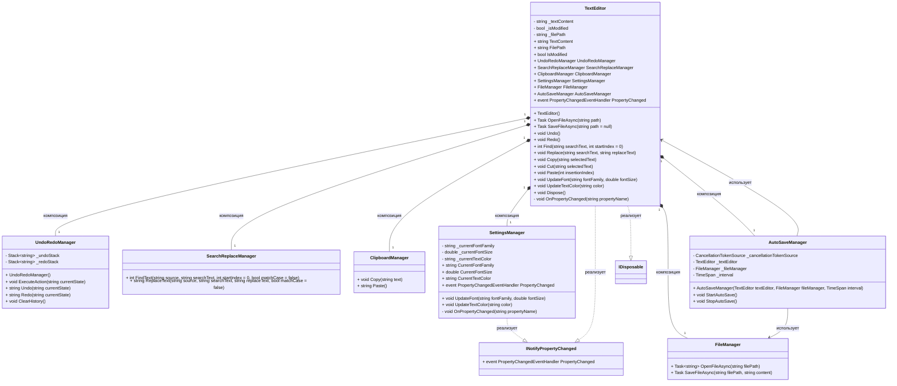

# Диаграмма классов

```mermaid
classDiagram

%% Класс TextEditor
class TextEditor {
    - string _textContent
    - bool _isModified
    - string _filePath
    + string TextContent
    + string FilePath
    + bool IsModified
    + UndoRedoManager UndoRedoManager
    + SearchReplaceManager SearchReplaceManager
    + ClipboardManager ClipboardManager
    + SettingsManager SettingsManager
    + FileManager FileManager
    + AutoSaveManager AutoSaveManager
    + TextEditor()
    + Task OpenFileAsync(string path)
    + Task SaveFileAsync(string path = null)
    + void Undo()
    + void Redo()
    + int Find(string searchText, int startIndex = 0)
    + void Replace(string searchText, string replaceText)
    + void Copy(string selectedText)
    + void Cut(string selectedText)
    + void Paste(int insertionIndex)
    + void UpdateFont(string fontFamily, double fontSize)
    + void UpdateTextColor(string color)
    + void Dispose()
    + event PropertyChangedEventHandler PropertyChanged
    - void OnPropertyChanged(string propertyName)
}

%% Класс UndoRedoManager
class UndoRedoManager {
    - Stack~string~ _undoStack
    - Stack~string~ _redoStack
    + UndoRedoManager()
    + void ExecuteAction(string currentState)
    + string Undo(string currentState)
    + string Redo(string currentState)
    + void ClearHistory()
}

%% Класс SearchReplaceManager
class SearchReplaceManager {
    + int FindText(string source, string searchText, int startIndex = 0, bool matchCase = false)
    + string ReplaceText(string source, string searchText, string replaceText, bool matchCase = false)
}

%% Класс ClipboardManager
class ClipboardManager {
    + void Copy(string text)
    + string Paste()
}

%% Класс SettingsManager
class SettingsManager {
    - string _currentFontFamily
    - double _currentFontSize
    - string _currentTextColor
    + string CurrentFontFamily
    + double CurrentFontSize
    + string CurrentTextColor
    + void UpdateFont(string fontFamily, double fontSize)
    + void UpdateTextColor(string color)
    + event PropertyChangedEventHandler PropertyChanged
    - void OnPropertyChanged(string propertyName)
}

%% Класс FileManager
class FileManager {
    + Task~string~ OpenFileAsync(string filePath)
    + Task SaveFileAsync(string filePath, string content)
}

%% Класс AutoSaveManager
class AutoSaveManager {
    - CancellationTokenSource _cancellationTokenSource
    - TextEditor _textEditor
    - FileManager _fileManager
    - TimeSpan _interval
    + AutoSaveManager(TextEditor textEditor, FileManager fileManager, TimeSpan interval)
    + void StartAutoSave()
    + void StopAutoSave()
}

%% Интерфейс INotifyPropertyChanged
class INotifyPropertyChanged {
    + event PropertyChangedEventHandler PropertyChanged
}

%% Отношения между классами
TextEditor "1" *-- "1" UndoRedoManager : композиция
TextEditor "1" *-- "1" SearchReplaceManager : композиция
TextEditor "1" *-- "1" ClipboardManager : композиция
TextEditor "1" *-- "1" SettingsManager : композиция
TextEditor "1" *-- "1" FileManager : композиция
TextEditor "1" *-- "1" AutoSaveManager : композиция

SettingsManager ..|> INotifyPropertyChanged : реализует
TextEditor ..|> INotifyPropertyChanged : реализует
TextEditor ..|> IDisposable : реализует

AutoSaveManager --> TextEditor : использует
AutoSaveManager --> FileManager : использует
```

# Скриншоты
## Основное окно

## Работа с несколькими текстами

## Настройка шрифта

## Настройка цвета

## Поиск и замена

## Печать

